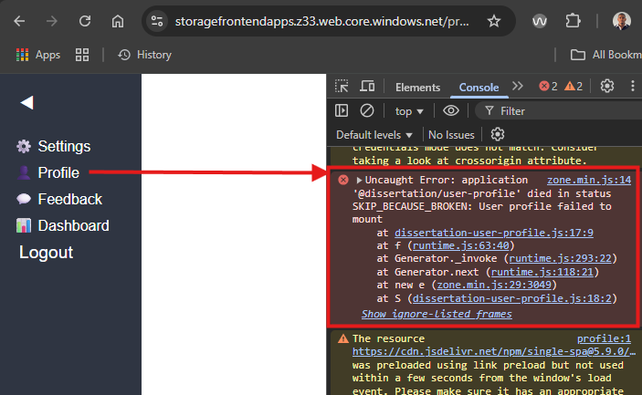
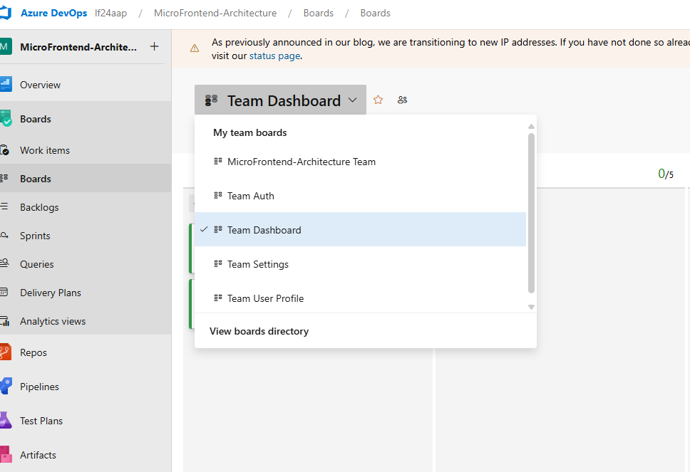
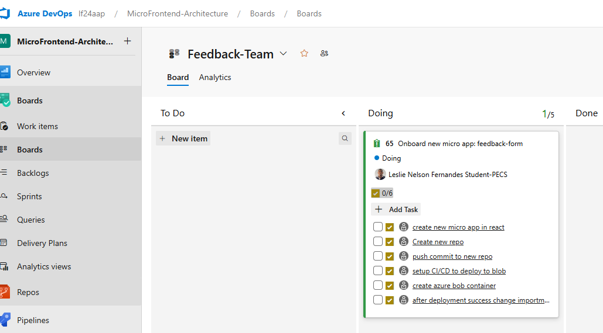

# Microfrontend architecture Portfolio (MSc dissertation)

This repository serves as a centralized showcase for my micro frontend research.

## Projects

### 1. [Shell/ Orchestrator App](https://github.com/leslie628/Shell-app)  
This is the main container App that has minimal UI code, focusing solely on orchestrating the different micro apps. It has a single spa layout engine implementation and import maps JSON that contain the different microapps (Azure storage path).

### 2. [Dashboard shell Microfrontend](https://github.com/leslie628/dashboard-shell)  
Dashboard shell micro app which orchestrates its own child micro apps. The purpose of this is to facilitate flexibility in the future addition of new features as new micro apps, as the dashboard shell evolves. The dashboard shell will register the micro apps dynamically, but the micro apps will be added to the shell app import maps. Therefore, there is no need to redeploy the dashboard shell microapp to reflect new child micro apps, as these can be added directly from the root app.

### 3. [Dashboard Microfrontend](https://github.com/leslie628/dashboard-app)  
Main user dashboard micro app -> child micro app of Dashboard shell.

### 4. [Settings Microfrontend](https://github.com/leslie628/settings-app)  
Settings micro app.

### 5. [User profile Microfrontend](https://github.com/leslie628/user-profile)  
User profile micro app.

### 6. [Auth Microfrontend](https://github.com/leslie628/auth-app)  
Auth micro app (allows user to register and login). The micro app uses Azure functions for backend login and registration functionality. The Azure function base url is stored in shell app azure pipeline for security purposes and passed from the shell app to the auth micro app as props.

---

## Overview

Each microfrontend is developed as an independent repository to allow modular development, easy deployment,(CI/CD) and seamless integration using microfrontend architecture principles. The goal of this dissertation is to compare a monolith application with a micro frontend architecture to analyse and evaluate the benefits of modular development.

## Monolith vs Micro Frontend architecture diagram (my design as per repos). 

## Evaluation explanation

The key non-functional attributes of the micro frontend architecture that will be evaluated are scalability, maintainability, performance, team autonomy and framework flexibility. This evaluation includes a comparison with the monolithic application, highlighting how the micro frontend approach addresses its limitations.

## Scalability
Any number of micro apps can be plugged in the shell app without having to rebuild and redploy shell app. The shell app is decoupled from the micro app and does not need to know the internal details of the micro app. This is done by externalising two files importmap.json and routes.json. This can be done in the cloud storage itself and the shell app will dynamically generate the menu items using the routes from routes.json and register them. 

## Maintainability
Any time a change is needed or bug needs to be fixed, the team can clone the respective micro app repository and make the changes. Once the changes are pushed, the pipeline will be triggered automatically and the artifact will be deployed to the respective micro app blob container. Each micro app has its own repository, CI/CD pipeline and azure blob storage container as below. Additionally, if any micro app throws error it will be contained in that micro app and won't affect the shell app and other micro apps. The whole application continues to work properly.  

On the other hand, any small change for a monolith application will carry regression risks, because of tight coupling between modules. So, there are chances of breaking the whole app. A small change by a developer will trigger the pipeline for the entire code base, which results in more deployment time.

### Micro app repositories

### Micro app independent CI/CD pipelines.

### Micro app separate blob containers.

Shell app is marked in green and micro apps are marked in yellow.

### Error isolation for each micro app.

### Monolith whole application broken if any module breaks

## Performance
The shell app will only load the micro apps on demand using lazy loading. So initial load time will be less. Besides this, since the micro apps are modular and smaller in size, the load time will be much faster in browser. There are shared files requested by micro app which increases the size and number of requests in total tab, but these are loaded from disk for subsequent requests. The key point here is not the shared files but the size of the micro app file. See below screenshots for size of micro apps and load time. 

The size of main.js in the monolith application is larger as compared to the micro app. This is because it loads all modules in advance and does not need to request any resources on demand later.

### Network of monolith application

### Network of micro frontend application

### Micro app pipeline vs Monolith pipeline
Additionally, pipeline run time for each micro app is faster due to reduced code size. The monolith application pipeline runtime seems smaller here but will inevitably increase due to larger code size as the application evolves.

 

## Team autonomy
Separate teams created for each micro app and will take ownership of each micro app repository. Teams will work independently on each micro app which includes setting up the pipeline, repo and blob container. After development and deployment, teams have to plug the micro app by configuring the two files, routes.json and importmap.json as mentioned above in scalability attribute. See https://github.com/leslie628/Shell-app/blob/main/docs/azure-deployment.md

In case of a monolith, teams all work on the same repo. They build and deploy using a single pipeline. Teams will be blocked by each other. If one team is already running a pipeline deployment, other teams have to wait. Parallel deployment would not be possible. Merge conflicts will be common in such applications as no separation of concern.

### Separate teams for each mico app

### Team board task created for onboarding new micro app.

## Framework flexibility
Teams can use a technology of their choice to develop their micro app. No tight coupling between shell app and micro apps. 
### Micro app developed using angular framework.

### Micro app developed using react.

Feel free to explore the code in the repository

---

## Contact

[fernandesleslie48@gmail.com].

---

*Last updated: June 2025*
